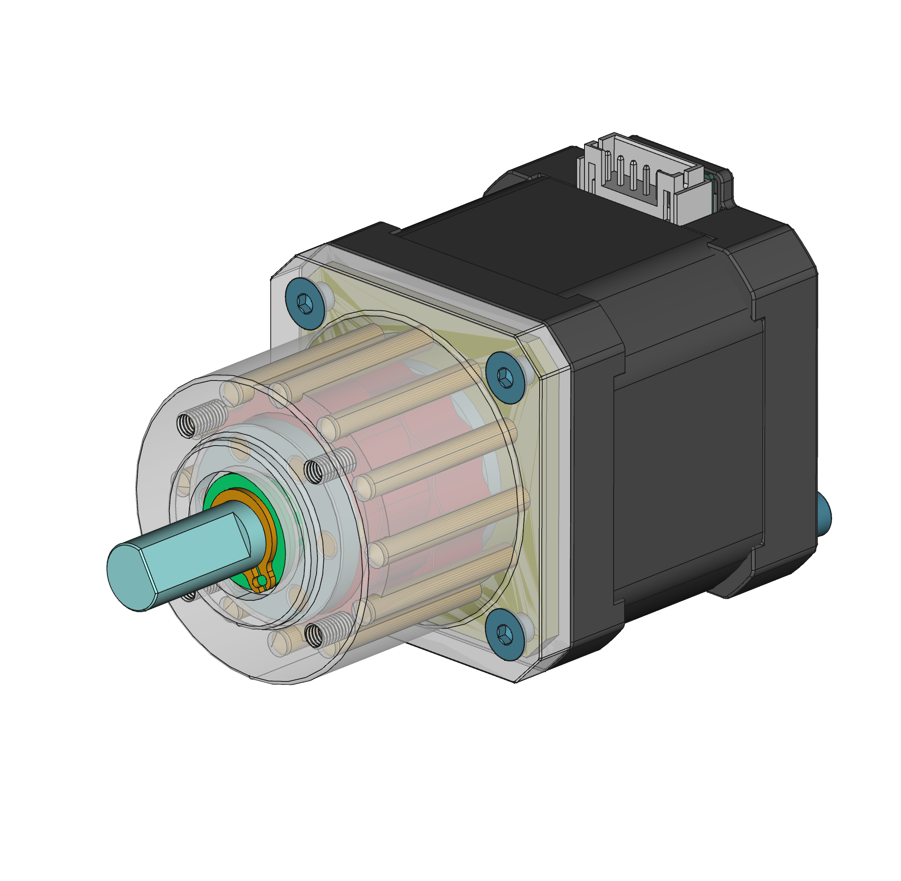
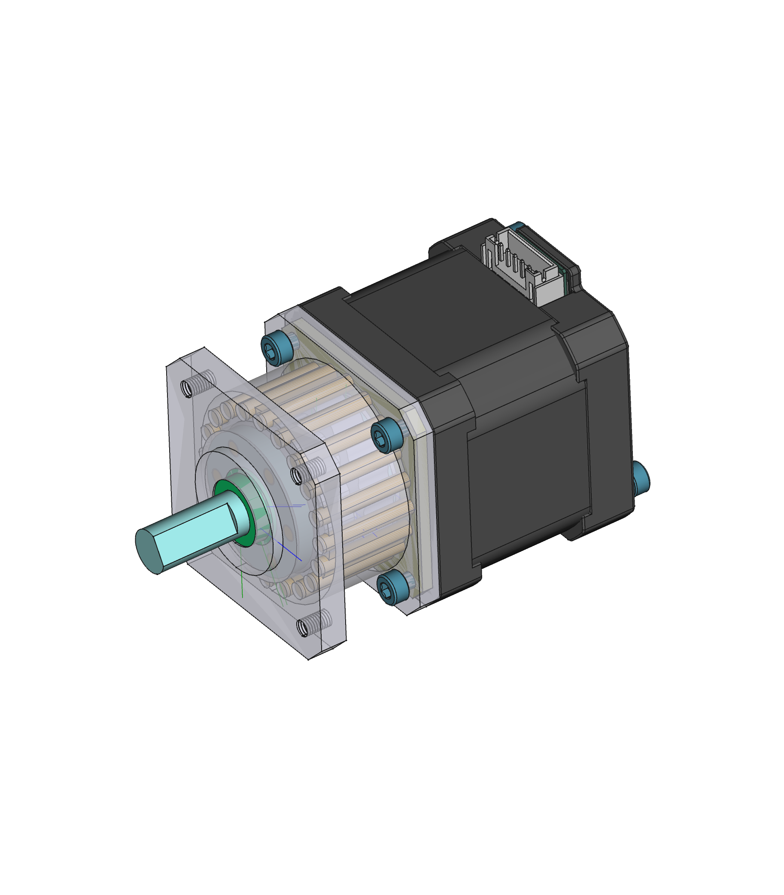

# Cycloidal Drive for NEMA17 Stepper Motor 

+ 240909 Revised for Ratio 11:1
+ 240908 Initial package of ratio 19:1 

## Design Parameters for Ratio 11 

+ Number of rollers: 12
+ Eccentricity: 0.5mm 
+ Roller diameter: 3mm 
+ Roller circle diameter: 30mm 
+ Pressure angle limit: 50 deg 
+ Pressure angle offset: 0.1mm 

## Design Paramters for Ratio 19 

+ Numer of rollers: 20 
+ Eccentricity: 0.5mm 
+ Roller diameter: 3mm 
+ Roller circle diameter: 32mm 
+ Pressure angle limit: 50 deg 
+ Pressure angle offset: 0.0mm

## Design Software 

+ FreeCAD [0.21.2](https://github.com/FreeCAD/FreeCAD/releases/tag/0.21.2)
+ [FreeCAD_Assembly4](https://github.com/Zolko-123/FreeCAD_Assembly4)
+ [FreeCAD_FastenersWB](https://github.com/shaise/FreeCAD_FastenersWB)
